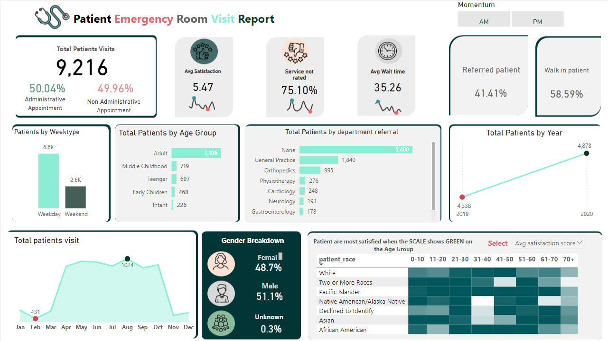
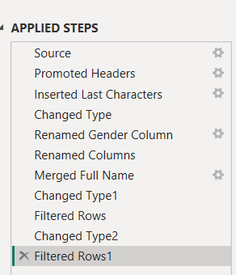
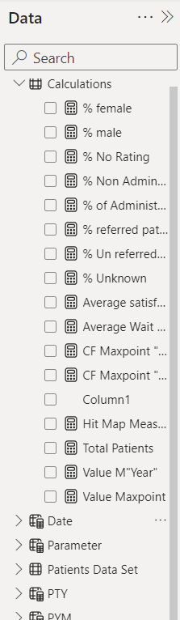

# Hospital-Emergency-Dashboard


| Hospital dashbaord |
| ----------- |
||


## Dashboard: 
[View Dashboard](https://app.powerbi.com/view?r=eyJrIjoiZTk3OWVjMzYtZmYyZC00N2JkLTk2NDQtN2RiMzQ2YjZiNTZiIiwidCI6IjU3ODFjYTE2LTUxYTYtNGU5OC05YmU5LWRjMmI5ZDAzYjgyZCJ9)

## Problem Statement

The problem statement addresses the need to enhance patient experiences in the emergency room, prompted by a moderate satisfaction score of 5.47 and a significant 75.10% of services not rated on the dashboard. Furthermore, the average wait time is 35.26 minutes, potentially influencing patient satisfaction negatively. The data also reveals satisfaction discrepancies across different races and age groups, as well as the distribution of referrals across departments. The objective is to pinpoint the causes of these issues and to implement improvements to increase feedback rates, reduce wait times, and balance satisfaction levels across all demographics. The statement invites contributors to analyze the provided `Hospital ER.csv` data and the dashboard image to develop solutions and predictive models to improve service quality in emergency room visits.


### Steps followed For data importing and cleaning in Power Query


1. **Source:** Imported data from the original data source.

2. **Promoted Headers:** Converted the first row of the data into column headers.

3. **Inserted Last Characters:** Potentially extracted or manipulated a subset of character data from a column.

4. **Changed Type:** Altered the data types of one or more columns to the appropriate format (e.g., text, number, date).

5. **Renamed Gender Column:** Changed the name of a column to more accurately reflect the data it contains, in this case, the gender information.

6. **Renamed Columns:** Similar to the previous step, more columns were renamed to improve clarity and understanding.

7. **Merged Full Name:** Combined first name and last name columns into a single 'Full Name' column or concatenated other text fields.

8. **Changed Type1:** Another change in data types, similar to step 4, indicating that multiple columns required adjustments.

9. **Filtered Rows:** Excluded rows based on certain criteria, which could be to remove irrelevant data or outliers.

10. **Changed Type2:** A further alteration of data types, suggesting that the dataset required several adjustments to column data types.

11. **Filtered Rows1:** An additional row filtering step, perhaps refining the dataset further after some initial cleaning was done.


| Data cleaning |
| ----------- |
||


### DAX Measures for Patient Emergency Room Visit Report

Below are the DAX measures based on the provided calculations using the 'patient data set' table:

1. **Percentage of Female Patients**
```dax
% Female = DIVIDE(
    COUNTROWS(FILTER(ALL('patient data set'), 'patient data set'[Gender] = "Female")),
    COUNTROWS(ALL('patient data set')),
    0
)
```

2. **Percentage of Male Patients**
```dax
% Male = DIVIDE(
    COUNTROWS(FILTER(ALL('patient data set'), 'patient data set'[Gender] = "Male")),
    COUNTROWS(ALL('patient data set')),
    0
)
```

3. **Percentage of Visits with No Rating**
```dax
% No Rating = DIVIDE(
    COUNTROWS(FILTER(ALL('patient data set'), ISBLANK('patient data set'[Rating]))),
    COUNTROWS(ALL('patient data set')),
    0
)
```

4. **Percentage of Non-Administrative Appointments**
```dax
% Non Administrative = DIVIDE(
    COUNTROWS(FILTER(ALL('patient data set'), 'patient data set'[AppointmentType] = "Non-Administrative")),
    COUNTROWS(ALL('patient data set')),
    0
)
```

5. **Percentage of Administrative Appointments**
```dax
% Administrative = DIVIDE(
    COUNTROWS(FILTER(ALL('patient data set'), 'patient data set'[AppointmentType] = "Administrative")),
    COUNTROWS(ALL('patient data set')),
    0
)
```

6. **Percentage of Referred Patients**
```dax
% Referred Patients = DIVIDE(
    COUNTROWS(FILTER(ALL('patient data set'), 'patient data set'[ReferralStatus] = "Referred")),
    COUNTROWS(ALL('patient data set')),
    0
)
```

7. **Percentage of Non-Referred Patients**
```dax
% Non Referred Patients = DIVIDE(
    COUNTROWS(FILTER(ALL('patient data set'), 'patient data set'[ReferralStatus] = "Non-Referred")),
    COUNTROWS(ALL('patient data set')),
    0
)
```

8. **Average Satisfaction Score**
```dax
Average Satisfaction = AVERAGE('patient data set'[SatisfactionScore])
```

9. **Average Wait Time**
```dax
Average Wait Time = AVERAGE('patient data set'[WaitTime])
```


| Dax Measures |
| ----------- |
||


# Insights from Patient Emergency Room Visit Report

Based on the analysis of the emergency room visit data, the following insights can be drawn:

1. **Gender Distribution:** The gender distribution of patients visiting the emergency room is relatively balanced. This indicates no significant gender-based disparity in the usage of emergency services.

2. **Wait Time Concerns:** The average wait time suggests that there may be operational inefficiencies or resource constraints that need to be addressed to improve patient flow and satisfaction.

3. **Service Ratings:** A notable percentage of services are not rated, which points to a potential gap in the patient feedback process. Improving the mechanism for collecting patient feedback could lead to more actionable insights for service improvement.

4. **Appointment Type Impact:** The close balance between administrative and non-administrative appointments may imply that both types of visits are equally important for the operational focus of the emergency department.

5. **Referral Patterns:** A significant portion of patients are not referred, which could suggest that many patients are using the emergency room for non-emergency issues or that primary care channels may be underutilized or unavailable.

6. **Patient Satisfaction Variability:** Patient satisfaction appears to vary across different demographics, indicating a need for targeted service improvements and potential cultural competence training for staff.

7. **Utilization Trends:** The year-on-year increase in patient numbers highlights the growing demand for emergency services, necessitating strategic planning in resource allocation and capacity management.

These insights can inform strategic decisions aimed at improving patient care, operational efficiency, and overall service quality in the emergency room.

**Suggestions for Action:**
- Review and streamline the patient intake and triage process to reduce wait times.
- Implement a more robust patient feedback system to ensure higher service rating participation.
- Analyze referral patterns and collaborate with primary care providers to optimize patient flow.
- Conduct detailed demographic analysis to understand and address the specific needs of different patient groups.

